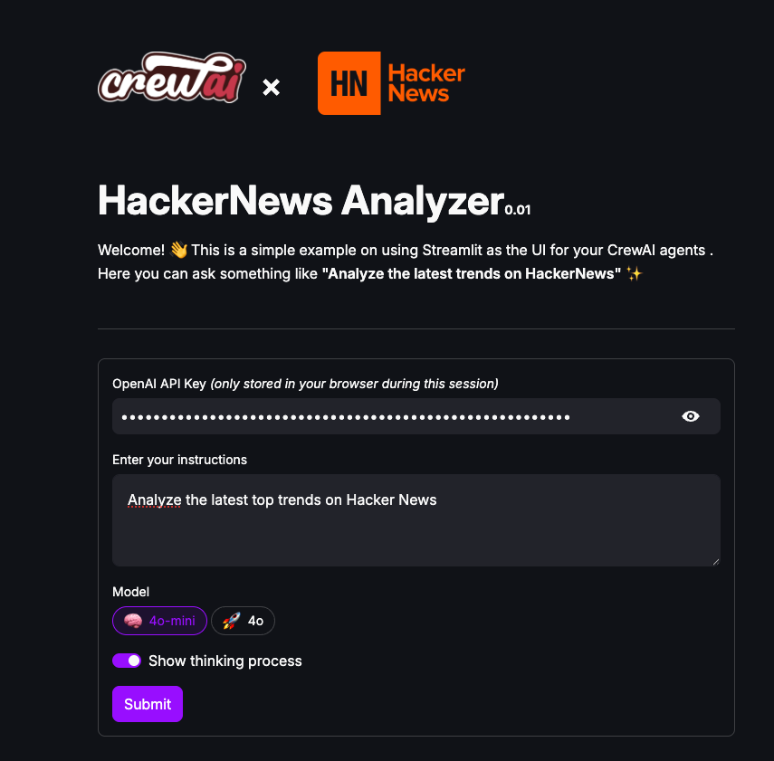

# CrewAI Streamlit Hacker News Demo

## Overview

A demonstration of integrating a CrewAI agent within a Streamlit UI to analyze top Hacker News posts. This project sets up a crew, tool, agent, and task to showcase core functionalities.

You can access a live version of the app [here](https://crewai-hackernews-demo.streamlit.app/).



## Features

- **Crew, Tool & Agent Integration:** Seamlessly fetch, analyze, and display top posts.
- **Interactive UI:** Leverages Streamlit for real-time visualization.
- **Modular Design:** Easy to maintain and extend.

## Installation

### Clone the repository and create a virtual environment

```bash
git clone https://github.com/ArthurVerrez/crewai-streamlit-hackernews-demo
cd crewai-streamlit-hackernews-demo
python -m venv env
```

### Activate the Environment

**Mac/Linux:**

```bash
source env/bin/activate
```

**Windows:**

```bash
env\Scripts\activate
```

### Install dependencies:

```bash
pip install -r requirements.txt
```

## Usage

(Optional) Set `LLM_API_KEY` in the `.env` file, then run the app:

```bash
streamlit run app.py
```

## Links

- [CrewAI](https://crewai.com/)
- [Hacker News](https://news.ycombinator.com/)
- [Streamlit](https://streamlit.io/)

## Disclaimer

Not affiliated with CrewAI or Hacker News.
